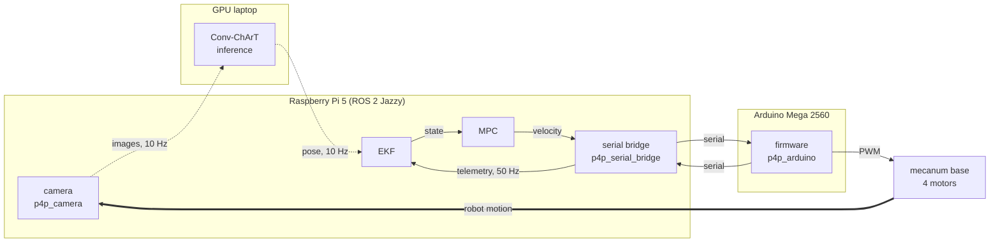

# Robust Autonomous Docking and Traversal of Robotic Motorway Barriers

**Project 41 — Part IV Research Project, University of Auckland**
Adam Wright and Kaelin Graf-Ogilvie, supervised by Professor Peter Xu.

A mecanum-wheeled mobile robot that autonomously docks with a movable motorway
barrier segment and then traverses along it. The robot localises itself against a
ChArUco fiducial on the barrier using a purpose-built convolutional–transformer
pose estimator, which runs off-board on a GPU laptop over WiFi while the Raspberry
Pi 5 on the robot keeps the state estimate and the control loop local.

This repository is the project's front door. No system code lives here — it holds
the architecture, the interface contracts between components, and the hardware
description, and it pins each component repository as a git submodule. That pinning
is the point: **one commit of this repository reproduces one exact state of the
whole system** — the perception weights, the ROS 2 stack, and the firmware that
together produced a given result.

---

## Components

| Component | Repository | Runs on | Role |
|---|---|---|---|
| **Perception model** | [`KaelinGraf/Conv-ChArT`](https://github.com/KaelinGraf/Conv-ChArT) | GPU laptop (training + inference) | Conv-ChArT: a hybrid conv–transformer network that detects and identifies all 16 inner corners of a 5×5 ChArUco board in one pass, refines them to sub-pixel, and solves a camera pose. Trained 100% synthetically. |
| **ROS 2 stack** | [`KaelinGraf/Conv-ChArT-Wireless-Inference`](https://github.com/KaelinGraf/Conv-ChArT-Wireless-Inference) | Pi 5 + GPU laptop | The distributed runtime: camera driver, ONNX inference node, serial bridge, shared message and QoS definitions, and the Pi-side Docker/compose environment. |
| **Firmware** | [`adamwright103/p4p_arduino`](https://github.com/adamwright103/p4p_arduino) | Arduino Mega 2560 | Hard-real-time layer: mecanum velocity mixing, BNO085 IMU, 400 ms command watchdog, and the line-oriented serial API to the Pi. |
| **Control** | _not yet created_ | Pi 5 | EKF state estimation fusing wireless pose with 50 Hz wheel/IMU telemetry, and the MPC that turns the resulting state into a body-velocity command. See [Status](#status). |

Each component repository carries its own full documentation. Start here for how
the pieces fit together; go there for how any one piece works.

---

## System architecture



*Dotted = WiFi · solid = wired · thick = physical motion.*

The loop closes through the world, not through a cable: motion of the base moves
the camera, which changes the next image, which changes the next pose. The only
wireless hop is the image/pose exchange with the laptop — everything that has to
be timely (the filter, the controller, the watchdog) stays on the robot, so a
dropped WiFi frame degrades the state estimate instead of stalling the control
loop.

**Compute placement**

| Node | Location | Why there |
|---|---|---|
| camera | Pi 5 | Attached to the sensor (Arducam OV2311 via CSI) |
| Conv-ChArT inference | GPU laptop | The only node needing a discrete GPU; the Pi cannot run the network at rate |
| EKF | Pi 5 | Must run at a fixed rate regardless of link health |
| MPC | Pi 5 | Must not depend on the wireless link |
| serial bridge | Pi 5 | Owns the USB serial device to the Mega |
| firmware | Arduino Mega 2560 | Hard real-time: motor mixing, IMU, watchdog |
| mecanum base | 4 motors | — |

Full link table, ROS topic/service contract, QoS and timing budgets:
**[docs/architecture.md](docs/architecture.md)**.
Platform, wiring and pin map: **[docs/hardware.md](docs/hardware.md)**.

---

## Getting the code

Clone with submodules to get the whole system at a known-good combination of
commits:

```bash
git clone --recurse-submodules https://github.com/adamwright103/autonomous-barrier-docking.git
cd autonomous-barrier-docking
```

Already cloned without `--recurse-submodules`:

```bash
git submodule update --init --recursive
```

If you would rather have independent working repositories than pinned submodules,
`scripts/clone-all.sh` clones each component side by side at its default branch
instead:

```bash
./scripts/clone-all.sh ~/barrier-docking
```

**Advancing a pin.** Submodules are pinned deliberately, so they do not follow
their upstream branches until you say so:

```bash
git submodule update --remote components/ros-stack
git commit -am "bump ros-stack to <short sha>"
```

Then build and run from the component repositories — the ROS stack's own README
covers the Pi container, the laptop inference node and the launch files.

---

## Repository layout

```
autonomous-barrier-docking/
├── README.md                this file
├── docs/
│   ├── architecture.md      link table, ROS interface contract, timing and QoS
│   └── hardware.md          platform, wiring, pin map, serial link
├── scripts/
│   └── clone-all.sh         submodule-free alternative: clone each repo side by side
├── components/              submodules — pinned commits, not copies
│   ├── conv-chart/          -> KaelinGraf/Conv-ChArT
│   ├── ros-stack/           -> KaelinGraf/Conv-ChArT-Wireless-Inference
│   └── firmware/            -> adamwright103/p4p_arduino
├── CITATION.cff
└── LICENSE                  GPL-3.0
```

---

## Status

| Component | State |
|---|---|
| Conv-ChArT model (detector, refiner, Stage-3 pose) | implemented, 56 tests |
| ONNX inference node + wireless transport | implemented |
| Camera driver (`p4p_camera`) | implemented, merged |
| Serial bridge (`p4p_serial_bridge`) | implemented, merged |
| Mega firmware (drive, IMU, watchdog, serial API) | implemented |
| **EKF** | planned — consumes `inference_result` + `drive/telemetry` |
| **MPC** | planned — publishes `cmd_vel` |
| Full docking + traversal integration | pending the control layer |

The two planned nodes have a fixed contract already: the messages they consume and
produce exist and are documented in [docs/architecture.md](docs/architecture.md).
Where they will live — additional packages in the ROS stack, or a fourth component
repository — is still open.

---

## Safety

The firmware holds three independent interlocks, and anything commanding this
robot must respect them:

1. **Boots disarmed.** No velocity command has any effect until an explicit `E`
   arms the motors; arming zeroes any stored velocity, so the robot cannot lurch
   off on a stale command.
2. **400 ms command watchdog.** If no velocity command arrives within the window,
   the firmware zeroes the wheels and raises `TIMEOUT`. A hold-station command is
   `V,0,0,0`, which keeps feeding the watchdog — silence is not a hold.
3. **Software e-stop.** `S` disarms and zeroes immediately, and the robot ignores
   velocity commands until re-armed.

The serial bridge surfaces all three in `drive/status` and distinguishes a
deliberate hold (`RUNNING` with a commanded zero) from a stalled controller
(`STALLED`) — a distinction that is invisible in the firmware telemetry alone.

---

## Not in this repository

The mechanical design and the written report are internal and are deliberately
not published here:

- CAD models, mechanical drawings, and the docking coupler geometry
- The project report and the risk assessment
- Chassis dimensions, battery and power distribution, and the active
  illumination hardware — these live in the CAD and the report rather than in
  code

If you need any of it — to reproduce the build, to check a dimension against the
mecanum mixing constants, or to review the risk assessment — open an issue or
get in touch with [@adamwright103](https://github.com/adamwright103) and it can
be sent on request.

---

## Authors

| | |
|---|---|
| Adam Wright | [@adamwright103](https://github.com/adamwright103) |
| Kaelin Graf-Ogilvie | [@KaelinGraf](https://github.com/KaelinGraf) |
| Supervisor | Professor Peter Xu |

Department of Mechanical and Mechatronics Engineering, University of Auckland.

## License

GPL-3.0, matching the component repositories. See [LICENSE](LICENSE).

## Citing this work

See [CITATION.cff](CITATION.cff), or use GitHub's "Cite this repository" button.
